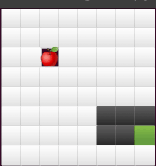
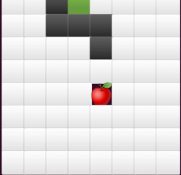

# Snake Game with DQN

---


[//]: # (![snake_demo]&#40;rsc/demo2.gif&#41;)

## Training

---
```bash
python snake_train.py
```
3개의 추가 옵션들이 있습니다.

- `--force-now: bool[Default=True]`: log 폴더 이름을 현재 시간 기준으로 생성합니다.
- `--model: str[Default=None]`: 해당 경로의 학습된 모델을 불러서 training 합니다.
- `--config: str[Default=None]`: 해당 경로의 config 파일을 불러서 사용합니다.

### Trainer Tuning
```python
# snake_train.py
env_params = SnakeParams(grid_size=(8, 8),
                         ...)

dqn_params = DQNParams(verbose=1,
                       ...)

learning_params = LearningParams(total_timesteps=200000,
                                 ...)
```
`snake_train.py` 내부에 파라미터를 관리하기 위한 3개의 dataclass가 있습니다.  
이 클래스들의 파라미터들을 수정하여 학습을 조정할 수 있습니다.  
각 클래스의 파라미터들은 `snake.param_manager.py`에 정의되어 있습니다.


## Evaluation

---

### Tensorboard
```bash
cd snake/logs/
tensorboard --logdir=.
```

위 코드를 통해 `snake/logs/` 폴더 내의 모든 training 기록에 대한 tensorboard log를 확인할 수 있습니다.

### Play
```bash
python snake_play.py [model_path] [config_path]
```
- `model_path`: 학습된 모델의 경로입니다.
- `config_path`: 학습에 사용된 config 파일의 경로입니다.

만약 1개의 argument만 주어진다면, 해당 경로를 log가 저장된 root 폴더로 간주하여
자동으로 `best_model.zip`과 `config.yaml`을 찾습니다.

추가적으로 다음의 option을 줄 수 있습니다.
- `--max-steps: int[Default=1000]`: 게임이 끝나기 전 최대 step 수입니다.
- `--mode: str[Default='human']`: rendering mode입니다. 환경에 따라 emoji가 제대로 보이지 않으므로 그런 경우 `char`로 설정해주세요.
- `--eval: bool[Default=False]`: 학습된 모델을 10 episode 동안 평가합니다.

## Progress

---

### snake가 loop에 빠지는 문제


- (예상) snake가 몸을 줄이려고 점점 회전 반경을 좁히면서 돌다가 더 이상 좁힐 수 없으면서
머리와 꼬리가 닿지 않는 경우 (머리 = 꼬리 면 대체로 최소 회전 반경 + 가로^2 + 세로^2 이 최소)

### food가 불가능한 위치에 생성되는 문제


- food가 불가능한 위치에도 생성될 수 있기 때문에 이런 경우 유의미한 학습이 불가능하게 되어 전체 학습 퀄리티를 망칩니다.